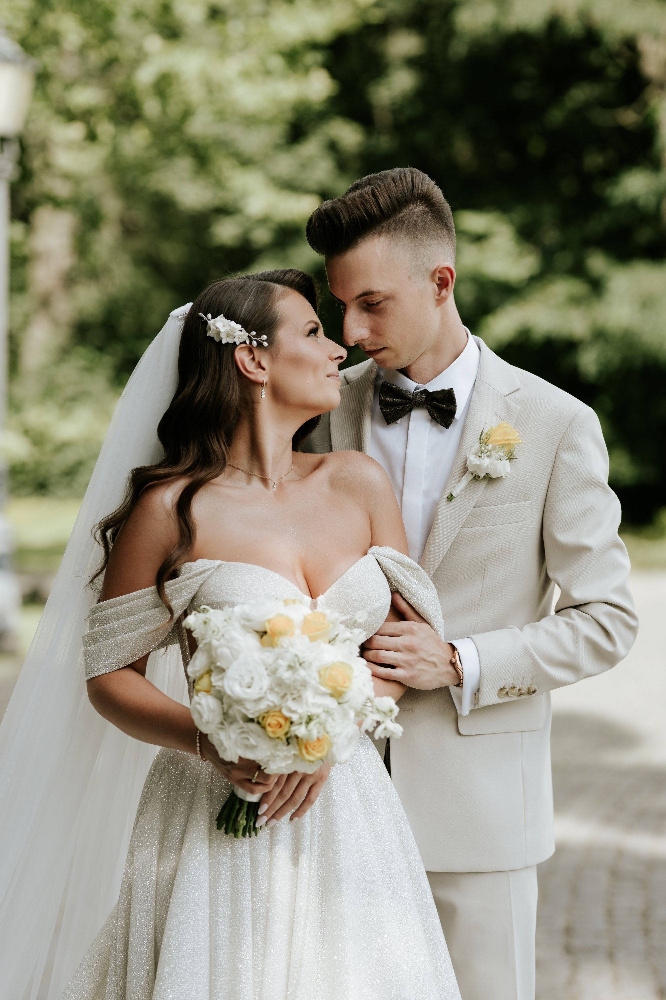
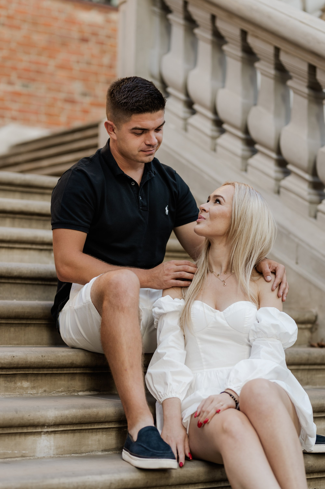
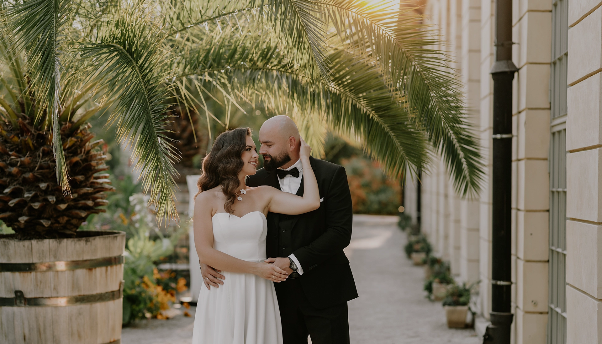
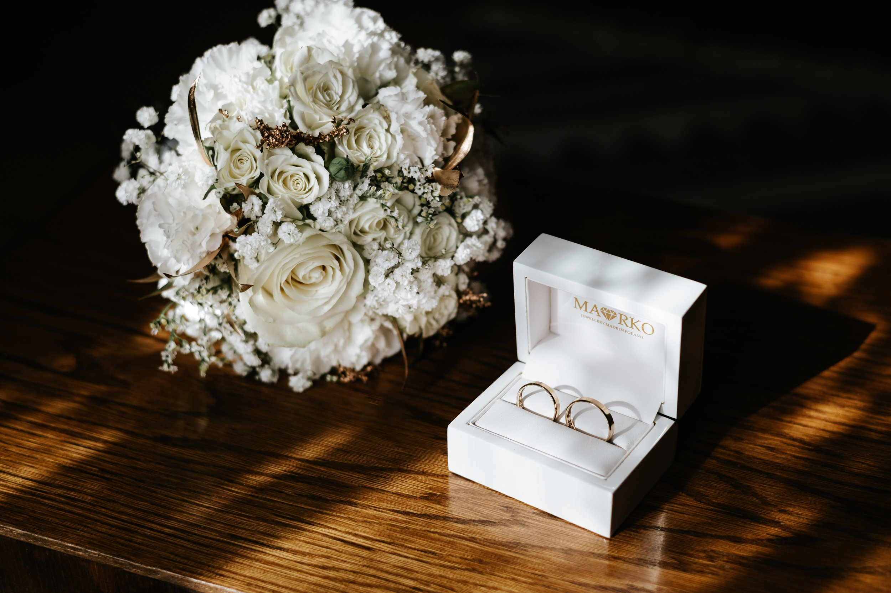

Kiedy pada hasło „sesja narzeczeńska", część par reaguje entuzjazmem, a część lekkim wahaniem — czy to na pewno potrzebne, skoro przecież będą zdjęcia ślubne? Rozumiemy to pytanie, słyszymy je często. Dlatego chcemy spokojnie opowiedzieć, dlaczego naszym zdaniem warto, i co tak naprawdę daje Wam wspólne popołudnie przed obiektywem na długo przed dniem ślubu.

Bo sesja narzeczeńska to nie jest kolejny punkt na liście wydatków ani sesja „bo tak wypada". To coś, co realnie zmienia Wasze zdjęcia ślubne i zostaje z Wami znacznie dłużej, niż mogłoby się wydawać.

## Przestajecie bać się aparatu

Zacznijmy od tego, co słyszymy najczęściej: _„my się w ogóle nie umiemy fotografować"_. Spokojnie — prawie nikt nie umie, dopóki nie spróbuje. Stawanie przed aparatem to umiejętność jak każda inna, a sesja narzeczeńska jest po prostu najlepszym momentem, żeby ją oswoić bez presji.

Podczas takiej sesji nie ma gości, nie ma napiętego harmonogramu, nie ma stresu, że za chwilę trzeba biec do kościoła. Jest tylko czas, żeby złapać luz. I dzieje się coś, co widzimy niemal za każdym razem: pierwsze dziesięć minut bywa sztywne, a potem para zapomina o obiektywie i zaczyna się po prostu bawić. To właśnie ten moment przenosi się później na dzień ślubu, bo aparat nie jest już czymś obcym.

## Poznajemy się, zanim zrobi się naprawdę poważnie

To jest powód, o którym mówi się zaskakująco rzadko, a dla nas jest jednym z najważniejszych. Sesja narzeczeńska to Wasza szansa, żeby sprawdzić, czy dobrze się z nami czujecie — zanim powierzycie nam jeden z najważniejszych dni w życiu.

W dniu ślubu nie ma już opcji „to jednak nie to". Dlatego dobrze jest wcześniej przekonać się, jak pracujemy: czy nasz sposób prowadzenia pary Wam odpowiada, czy przy nas się rozluźniacie, czy śmiejecie się z naszych podpowiedzi. Jeśli tak — do dnia ślubu podchodzicie już ze spokojem, bo wiecie, kto będzie obok Was z aparatem.

Ale ta znajomość działa w obie strony. Podczas sesji my również uczymy się Waszej pary. Widzimy, z której strony każde z Was wygląda najlepiej, kto ma bardziej nieśmiały uśmiech, jak na siebie reagujecie, co Was rozśmiesza. To wszystko zbieramy i wykorzystujemy potem w dniu ślubu — dzięki temu prowadzimy Was pewniej, bez zbędnych prób, i zdjęcia wychodzą naturalniej.

## Wasze zdjęcia zaczynają żyć własnym życiem

Sesja narzeczeńska daje Wam materiał, który wykorzystacie na długo przed weselnym tortem. Wiele par jest zaskoczonych, jak bardzo te zdjęcia się przydają. Można z nich zrobić naprawdę dużo:

- **zaproszenia ślubne i _save the date_** — z Waszym wspólnym zdjęciem zamiast anonimowej grafiki,
- **stronę weselną lub RSVP online**, jeśli zbieracie potwierdzenia od gości przez internet,
- **tablicę winietową i dekoracje na sali** — Wasze kadry witające gości przy wejściu,
- **podziękowania dla rodziców i gości**,
- a na koniec **wydruk na płótnie albo w albumie**, który zostaje z Wami w domu.

To zdjęcia, których po prostu wcześniej nie mieliście — bo mało która para ma dobre, wspólne fotografie zrobione „na spokojnie". Nagle okazuje się, że zamiast szukać zdjęcia z wakacji sprzed trzech lat, macie gotowy, spójny zestaw kadrów w jednym stylu.

## Pretekst, żeby wyrwać się z gorączki przygotowań

Przygotowania do ślubu potrafią pochłonąć bez reszty — sala, menu, kwiaty, lista gości, tysiąc telefonów. W tym wszystkim łatwo zapomnieć, że to Wasz wspólny czas, a nie tylko projekt do zrealizowania. Sesja narzeczeńska jest doskonałym pretekstem, żeby na chwilę wyjść z tego zamieszania i pobyć razem.

Umawiamy się zwykle o dobrej porze dnia — najczęściej tuż przed zachodem słońca, kiedy światło jest najładniejsze — i po prostu idziemy na spacer. Rozmawiamy, śmiejemy się, czasem zajdziemy na kawę. Zdjęcia robią się przy okazji, niejako same. Dla wielu naszych par to jedno z milszych popołudni całego okresu przygotowań i realny zastrzyk ekscytacji przed dniem ślubu.

## Gdzie robimy sesje narzeczeńskie?

Najczęściej pytacie, gdzie taka sesja może się odbyć. Nasza odpowiedź jest zawsze podobna: **tam, gdzie czujecie się dobrze**. Nie musi to być efektowna lokacja rodem z Pinteresta — dużo lepiej sprawdza się miejsce, które coś dla Was znaczy: park, w którym była pierwsza randka, ulubiona kawiarnia, łąka za miastem, brzeg rzeki.

Fotografujemy głównie w [Siedlcach i na Mazowszu](/fotograf-siedlce), ale równie chętnie jeździmy na [Podlasie, w okolice Białegostoku](/fotograf-bialystok). A że jesteśmy duetem, dojazd w Wasze ulubione miejsce nie jest dla nas problemem. Region mamy piękny i różnorodny: od klimatycznych zakątków miasta, przez pola i lasy, po nadrzeczne plenery, które o złotej godzinie wyglądają wyjątkowo. Jeśli macie w głowie konkretne miejsce — powiedzcie nam. Jeśli nie, chętnie coś podpowiemy, dopasowując lokację do pory roku i tego, co lubicie.

Warto dodać, że pracujemy we dwoje — Weronika i Mateusz. Dwie pary oczu na sesji to spokojniejsza atmosfera i większa różnorodność kadrów: jedno z nas prowadzi, drugie łapie te spontaniczne, niepozowane chwile z boku. Jeśli chcecie zobaczyć, jak wygląda nasza praca w dniu ślubu, opisaliśmy to dokładnie we wpisie [„Jak wygląda dzień ślubu z nami?"](/blog/jak-wyglada-dzien-slubu-z-nami).

## Kilka pytań, które słyszymy najczęściej

Zebraliśmy pytania, które pojawiają się przy okazji planowania sesji narzeczeńskiej — może rozwieją i Wasze wątpliwości.

### Kiedy najlepiej zrobić sesję narzeczeńską?

Zwykle na 2–6 miesięcy przed ślubem. Dzięki temu zdążycie wykorzystać zdjęcia na zaproszenia czy dekoracje, a jednocześnie nie „przeleżą się" one zbyt długo. Najładniejsze światło jest o wschodzie i tuż przed zachodem słońca i to właśnie te pory najczęściej proponujemy.

### Ile trwa sesja?

Przeważnie od jednej do dwóch godzin. To spokojny spacer, a nie wyścig z czasem — chodzi o to, żeby dać sobie przestrzeń na złapanie luzu i kilka zmian miejsca.

### Co ubrać na sesję narzeczeńską?

Przede wszystkim wygodnie i w swoim stylu, tak, żebyście czuli się sobą. Dobrze, gdy Wasze stroje do siebie pasują kolorystycznie, bez ubierania się „na jedno kopyto". Warto dopasować je do miejsca i pory roku. Jeśli macie wątpliwości, zawsze doradzimy przed sesją.

### Ile zdjęć dostaniemy?

Otrzymujecie od nas komplet obrobionych, wywołanych zdjęć z całej sesji — w liczbie, która realnie oddaje jej przebieg, a nie sztucznie ograniczonej. Szczegóły zawsze ustalamy indywidualnie, więc po prostu o to zapytajcie.

### Czy sesja narzeczeńska jest w cenie pakietu ślubnego?

W naszych większych pakietach ślubnych sesja narzeczeńska jest wliczona — traktujemy ją jako naturalną część współpracy, a nie dodatek. Można też zamówić samą sesję, niezależnie od reportażu ślubnego. Napiszcie do nas, a podpowiemy, która opcja będzie dla Was najkorzystniejsza.

## Na koniec — bo narzeczeństwo trwa tylko chwilę

Jest jeszcze jeden powód, chyba najważniejszy, choć najtrudniejszy do ujęcia w praktyczne argumenty. Narzeczeństwo to krótki, wyjątkowy etap — pełen planów, ekscytacji i tego specyficznego oczekiwania, które nigdy już nie wróci. Sesja narzeczeńska jest jedynym momentem, żeby go zatrzymać.

Za kilka lat te zdjęcia nie będą dla Was „ładnymi kadrami sprzed ślubu". Będą początkiem Waszej wspólnej historii, zapisanej od samego początku. I właśnie dlatego, kiedy pytacie nas, czy warto — odpowiadamy: tak, zdecydowanie warto.

Jeśli myślicie o sesji narzeczeńskiej gdziekolwiek na Mazowszu lub Podlasiu, [napiszcie do nas](/kontakt). Chętnie opowiemy więcej, pokażemy [nasze portfolio](/portfolio) i wspólnie zaplanujemy Wasze zdjęcia.
