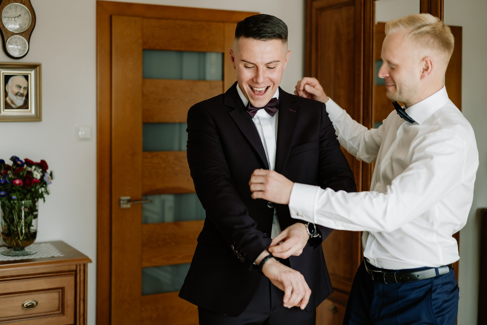
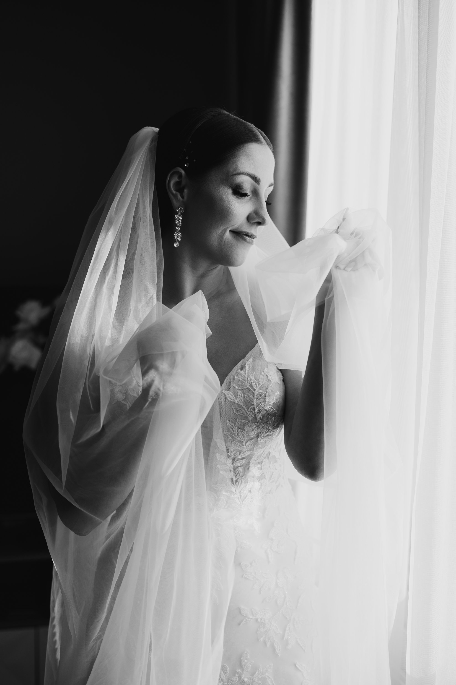
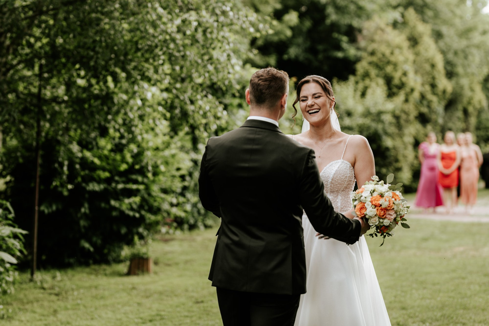
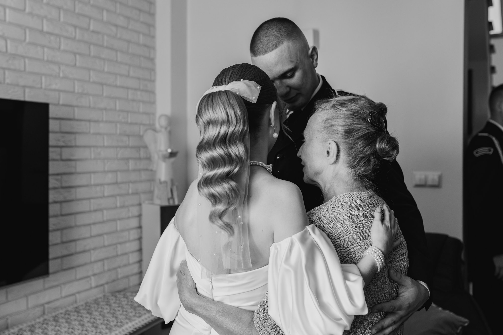
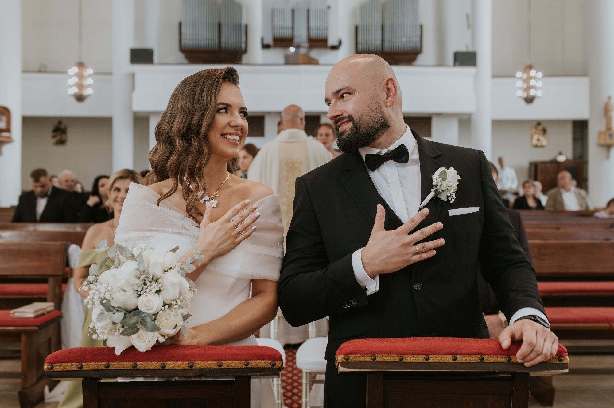
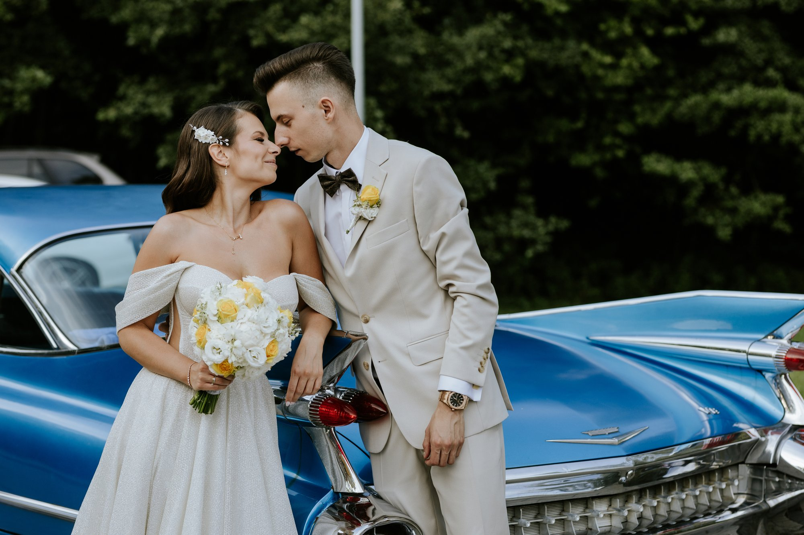
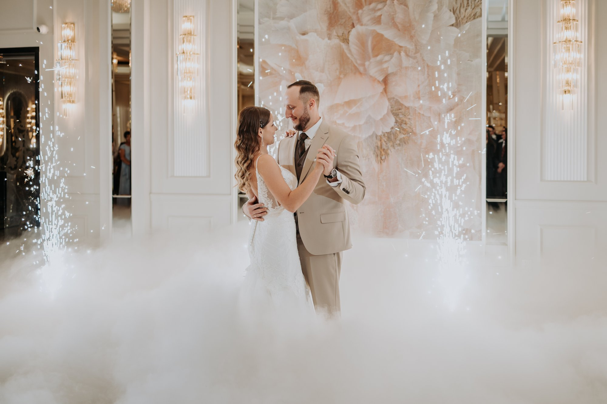

Jeśli jesteście przed swoim ślubem, to bardzo możliwe, że oprócz ekscytacji pojawia się też stres. To zupełnie normalne. Wiele par zastanawia się, jak właściwie wygląda dzień reportażu ślubnego, kiedy przyjeżdżamy, co robimy, czy będzie dużo pozowania i czy w tym wszystkim znajdzie się jeszcze przestrzeń, żeby po prostu przeżyć ten dzień po swojemu.

Aby nieco zapoznać Was z naszym stylem działania i pokazać, że naprawdę nie ma się czym stresować, przygotowaliśmy krótki przewodnik po tym, jak zazwyczaj wygląda nasza praca. Oczywiście każdy ślub jest inny, potraktujcie to jako pogląd, który pomoże Wam przygotować się do reportażu.

## Przygotowania Pana Młodego — spokojne wejście w dzień

Naszą wspólną przygodę rozpoczynamy około trzy godziny przed ceremonią. Zazwyczaj pierwszym celem są przygotowania Pana Młodego. Ten etap reportażu zajmuje zwykle do godziny. To moment na zdjęcia detali i tych małych elementów, które budują klimat całego dnia — spinki, mucha albo krawat, perfumy czy zegarek. Jeśli macie ochotę, znajdujemy też chwilę na kilka luźnych kadrów ze świadkiem, czasem przy symbolicznej szklance whisky. Tymczasem my chwytamy spontaniczne uśmiechy, a na koniec wykonujemy kilka klasycznych portretów.

## Czas dla Panny Młodej

Następnie przenosimy się do Panny Młodej, gdzie spędzamy trochę więcej czasu, bo do około dwóch godzin. Jeśli końcowe poprawki makijażu i fryzury odbywają się na miejscu, także łapiemy je w kadrach. Te chwile są zazwyczaj dynamiczne, pełne emocji i lekkiego zamieszania, a my szukamy w nich niepozowanych, szczerych uśmiechów.

Bardzo często przed założeniem sukni znajdujemy czas na luźne zdjęcia w szlafrokach i toast z szampanem. To świetny sposób na rozładowanie resztek napięcia i stworzenie naturalnych kadrów z druhną.

Samo zakładanie sukni ślubnej, welonu, biżuterii — to momenty, które fotografują się niemal same. Szukamy najlepszego światła w Waszym domu i łapiemy naturalne portrety Panny Młodej. W tych chwilach dbamy także o to, by suknia układała się jak należy. Nieraz zdarzało się także, że pomagaliśmy w skomplikowanych zapięciach sukni czy rozplątaniu łańcuszka.

Towarzyszymy Wam również podczas spotkań z najbliższymi — pierwsze łzy wzruszenia w oczach mamy, szczery uśmiech babci, te kadry mają ogromną wartość sentymentalną i zawsze zajmują potem szczególne miejsce w albumie.

## First look jako chwila dla Was

Gdy Panna Młoda jest gotowa, Pan Młody dostaje zielone światło. W tym momencie większość naszych par decyduje się na tak zwany _First Look_. To moment tylko dla Was, w którym widzicie się po raz pierwszy w swoich ślubnych strojach, bez tłumu gości wokół. Często aranżujemy to w ogrodzie lub cichym zakątku domu. Z perspektywy fotograficznej uwielbiamy te chwile wzruszenia, szczere uściski i spojrzenia pełne zachwytu. Jesteśmy wtedy nieco dalej, dając Wam przestrzeń na to, by nacieszyć się sobą.

Zaraz po first looku następuje błogosławieństwo w gronie rodzinnym. Kiedy opadną już największe emocje z pierwszego spotkania, chwile z najbliższymi stają się piękną tradycją domykającą etap domowych przygotowań. W domu Panny Młodej zawsze znajdziemy też czas na zdjęcia w rodzinnym gronie — po latach to właśnie one potrafią znaczyć naprawdę dużo.

## Ceremonia ślubna

Po przygotowaniach jedziemy do kościoła albo na miejsce ceremonii. W czasie samego ślubu skupiamy się przede wszystkim na tym, żeby niczego nie zakłócać. Jesteśmy uważni, czujni i tam, gdzie trzeba — ale nie tak, żebyście czuli aparat bardziej niż sam moment. Nasza praca w duecie pozwala nam w tym czasie na pokazanie historii z dwóch zupełnie różnych perspektyw.

Jeżeli po ceremonii składane są życzenia pod kościołem, najczęściej fotografujemy ich początek, następnie jedziemy na salę, aby zrobić zdjęcia dekoracji i przygotować się na Wasz przyjazd.

## Mini plener w dniu ślubu

Wiemy, jak ważne są piękne, romantyczne portrety we dwoje. Jednocześnie zdajemy sobie sprawę, że nie każda para chce lub może pozwolić sobie na odrębną sesję poślubną w innym terminie. Dlatego w trakcie trwania reportażu weselnego zawsze staramy się znaleźć moment na mini plener, który trwa do piętnastu minut. Gdzie się udajemy? Tam, gdzie spontanicznie widzimy do tego warunki — może to być kawałek zieleni za domem, ogród otaczający kościół, czy pobliska łąka tuż przy sali weselnej. Często obrabiamy i drukujemy kilka z tych zdjęć jeszcze tego samego dnia na sali. Stanowią one rewelacyjny materiał do podziękowań dla rodziców lub jako pamiątka dla gości.

## Pora na zabawę!

Wesele to czas, kiedy wreszcie możecie się wyluzować. My nadal jesteśmy obok — od pierwszego tańca, przez tort, po szaleństwa na parkiecie. Staramy się utrzymywać luźny klimat przez cały dzień, pomagać i podpowiadać, jeśli tego potrzebujecie.

Kiedy robi się ciemno, a warunki na to pozwalają, często proponujemy krótki wypad na dwór — na przykład na zdjęcia z zimnymi ogniami. To nie jest obowiązkowy punkt, tylko coś, co może pięknie uzupełnić reportaż i dać Wam kilka innych, bardziej klimatycznych kadrów.

Zazwyczaj zostajemy z Wami do około godziny 1:00, ale na tym nasza praca tego dnia się nie kończy. Po powrocie do domu zgrywamy wszystkie pliki, abyście mieli spokojną głowę, że Wasze zdjęcia są bezpieczne.

## Jak pracujemy we dwoje?

To, że jesteśmy duetem, bardzo pomaga w dniu ślubu. Każde z nas zwraca uwagę na trochę inne rzeczy i dzięki temu reportaż jest pełniejszy.

Weronika pilnuje tego, żebyście wyglądali korzystnie na zdjęciach — drobne poprawki i szczegóły, które robią różnicę. Mateusz zwraca uwagę na światło, bo to właśnie ono w ogromnym stopniu sprawia, że zdjęcia są naturalne i po prostu dobrze się je ogląda po latach.

Poza samym fotografowaniem staramy się też po prostu być wsparciem. Pomóc, podpowiedzieć, rozładować napięcie, ogarnąć drobiazgi. Nie tylko robić zdjęcia, ale też dawać Wam poczucie, że wszystko jest pod kontrolą.

## Na koniec — jedno zdanie, które powtarzamy każdej parze

**Nawet jeśli coś nie pójdzie po Waszej myśli — nikt z Waszych gości nie ma pojęcia, jaki był pierwotny zamysł.**

Jeśli coś wydarzy się trochę inaczej — goście nie odbiorą tego jako błąd. To po prostu będzie część Waszego dnia. A my jesteśmy po to, żeby to wszystko uchwycić tak, jak było naprawdę. Z uważnością na emocje, światło i ludzi wokół Was.

Jeśli więc zastanawiacie się, czy w dniu ślubu będzie miejsce na spokój, oddech i naturalne zdjęcia — tak, będzie. I właśnie o to chcemy zadbać.
